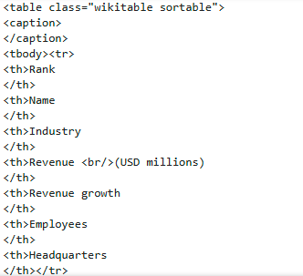
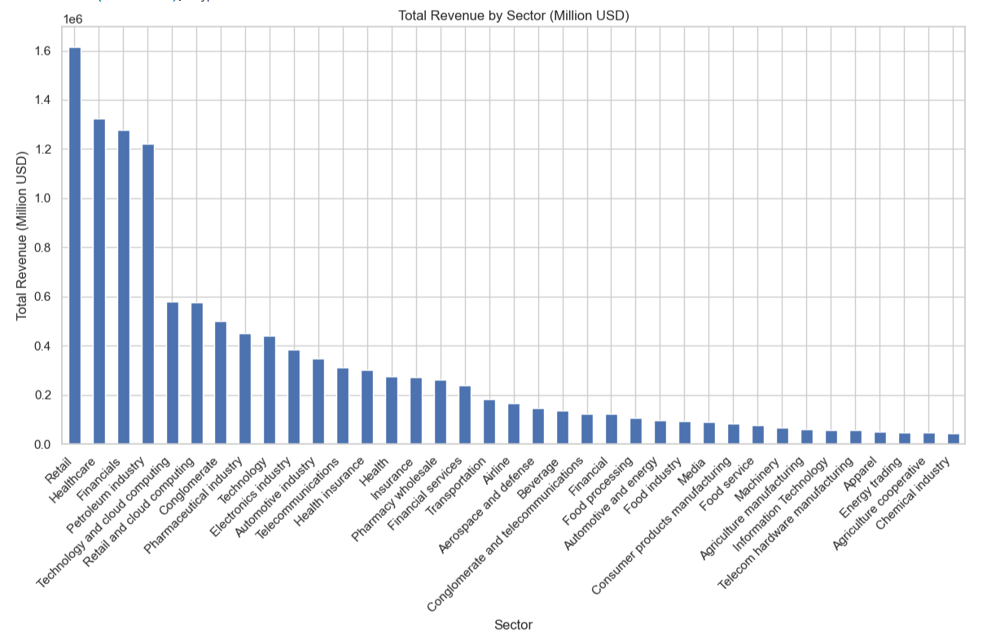
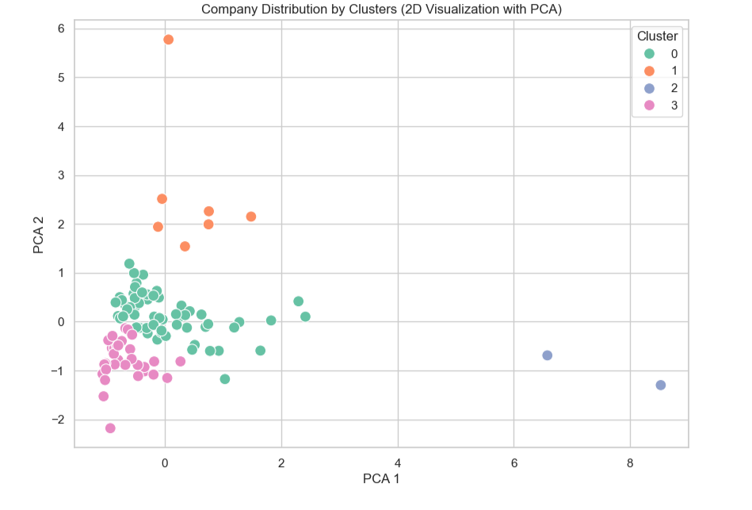
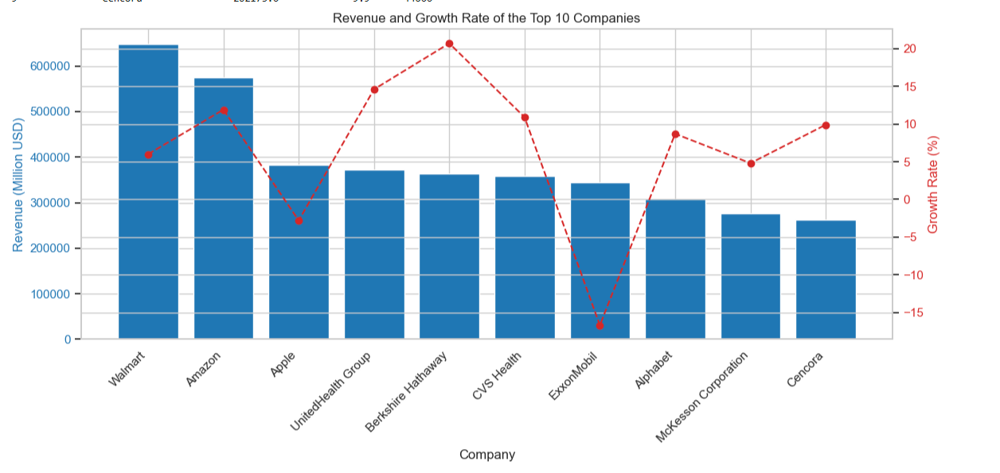

# 📡 Python Web Scraping & Analysis of Largest US Companies

This project performs web scraping of the top 100 US companies' data from Wikipedia using Python. It includes detailed data analysis with pandas and visualization with seaborn and matplotlib. Analyses cover sector distribution, revenue and growth rates, employee correlation, geographic distribution, and clustering.

---

## 📌 Project Overview

This project aims to extract, process, and analyze data of the largest 100 companies in the United States. Using Python, web scraping techniques were applied to retrieve the data directly from Wikipedia. The collected dataset was then cleaned and transformed for comprehensive exploratory data analysis.

Key focus areas of the analysis include:

- Sector-wise distribution of companies  
- Revenue statistics and growth trends  
- Relationship between employee count and revenue  
- Geographic distribution of company headquarters  
- Clustering companies based on financial and operational metrics  
- Performance comparison of the top companies  

The project demonstrates practical applications of web scraping, data cleaning, statistical analysis, visualization, and machine learning techniques in Python to gain valuable insights into major US companies.
---

## 🛠️ Tools Used

| Tool                 | Purpose                                         |
|----------------------|------------------------------------------------|
| **Python**           | Data analysis and modeling                      |
| **Jupyter Notebook** | Interactive development and documentation      |
| **Pandas & NumPy**   | Data manipulation and numerical operations      |
| **Scikit-learn**     | K-Means clustering algorithm                    |
| **Matplotlib & Seaborn** | Data visualization and plotting             |
| **BeautifulSoup4**   | Web scraping and HTML parsing                   |
| **Requests**         | HTTP requests for web data retrieval            |

---

## 📋 Methods Applied

This project implements the following methods and techniques:

- **Web Scraping:** Extracting data directly from Wikipedia using BeautifulSoup and requests libraries.  
- **Data Cleaning:** Removing unwanted characters, converting data types, and handling missing values to prepare the dataset for analysis.  
- **Exploratory Data Analysis (EDA):** Using pandas and visualization libraries (matplotlib, seaborn) to understand distributions, correlations, and trends.  
- **Clustering:** Applying K-Means algorithm to group companies based on revenue, growth, and employee count.  
- **Dimensionality Reduction:** Using PCA (Principal Component Analysis) to visualize clusters in two dimensions.  
- **Visualization:** Creating bar charts, scatter plots, heatmaps, and boxplots to present insights clearly.

These methods collectively provide a comprehensive approach to analyze and interpret the dataset of the largest US companies.

---

## 🗂️ Repository Structure
- 🇹🇷 [`ABD_Buyuk_Sirketler_Analizi.ipynb`](ABD_Buyuk_Sirketler_Analizi.ipynb) : Turkish Jupyter Notebook containing the analysis and modeling steps  
- 🇹🇷 [`ABD_Buyuk_Sirketler_Analizi.py`](ABD_Buyuk_Sirketler_Analizi.py) : Python script version of the notebook 
- 🇺🇸 [`US_Major_Companies_Analysis.ipynb`](US_Major_Companies_Analysis.ipynb) : English Jupyter Notebook containing the analysis and modeling steps  
- 🇺🇸 [`US_Major_Companies_Analysis.py`](US_Major_Companies_Analysis.py) : Python script version of the notebook  
- 📊 [`Companies.csv`](Companies.csv) : CSV file extracted and created from Wikipedia data
- 📄 [`README.md`](README.md) : Project description and documentation  

---

## 📈 Key Insights

- **Sector Dominance:** Petroleum, healthcare, and technology sectors lead in both company count and total revenue.  
- **Revenue-Employee Correlation:** There is a strong positive correlation (~0.7) between revenue and number of employees, indicating larger companies employ more people.  
- **Growth Patterns:** Majority of companies show positive revenue growth; however, some sectors experience decline.  
- **Geographic Concentration:** Texas, New York, and California host the highest number of large companies.  
- **Cluster Analysis:** Companies form four meaningful clusters based on revenue, growth, and employee count:  
  - Clusters 0 & 1: Medium-sized companies with positive growth (~150-160k employees).  
  - Cluster 2: Large corporations with very high revenue and employee count (e.g., Walmart).  
  - Cluster 3: Smaller companies with negative growth trends.

These insights provide a comprehensive understanding of the largest US companies and support strategic decision-making.

---

## 💡 Recommendations

- **Personalized Marketing:** Tailor promotions and communication strategies for each customer segment to maximize engagement and conversion.  
- **Loyalty Programs:** Focus on rewarding high-value segments to boost retention and lifetime value.  
- **Product Assortment Optimization:** Align inventory and offerings with preferences of niche and premium customer segments.  
- **Reactivation Campaigns:** Target low-activity or dormant customers with special offers to increase re-engagement.  
- **Geographic Targeting:** Use regional insights to localize marketing efforts and explore new market opportunities.  
- **Continuous Monitoring:** Regularly update segmentation models and analyze customer behavior to keep strategies effective.  

---

## 🌐 Data Source

The data used in this project was extracted via web scraping from the Wikipedia page:  
[https://en.wikipedia.org/wiki/List_of_largest_companies_in_the_United_States_by_revenue](https://en.wikipedia.org/wiki/List_of_largest_companies_in_the_United_States_by_revenue)

---

## 📸 Screenshots

Below are some screenshots showcasing key parts of the analysis:

1. **Web Scraping Result**  
   

2. **Sector-wise Revenue Distribution**  
   

3. **Clustering Visualization (PCA Plot)**  
   

4. **Top 10 Companies Revenue and Growth**  
   
---

## 📬 Contact

- **GitHub:** [github.com/seckinozler](https://github.com/seckinozler)  
- **LinkedIn:** [linkedin.com/in/seckinozler](https://www.linkedin.com/in/seckinozler/)  
- **Website:** [seckinsafakozler.wixsite.com/portfolio](https://seckinsafakozler.wixsite.com/portfolio)

---

